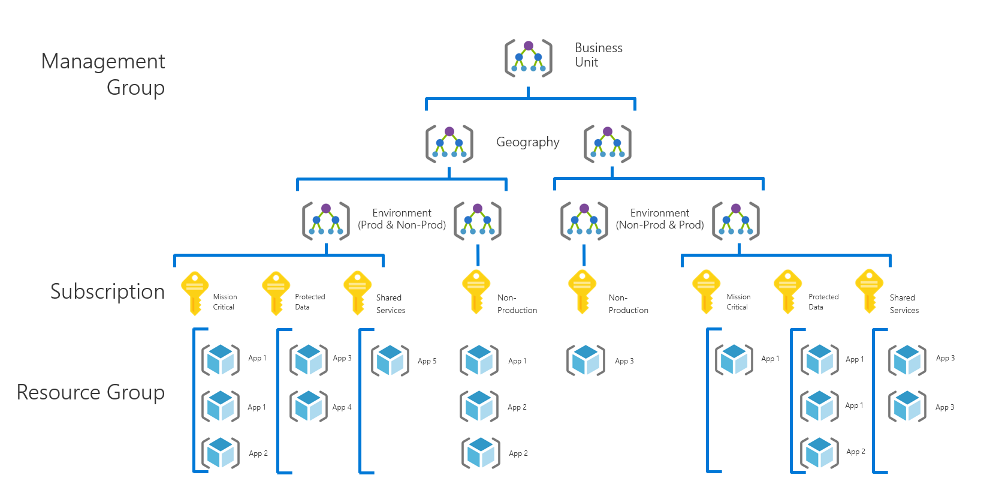
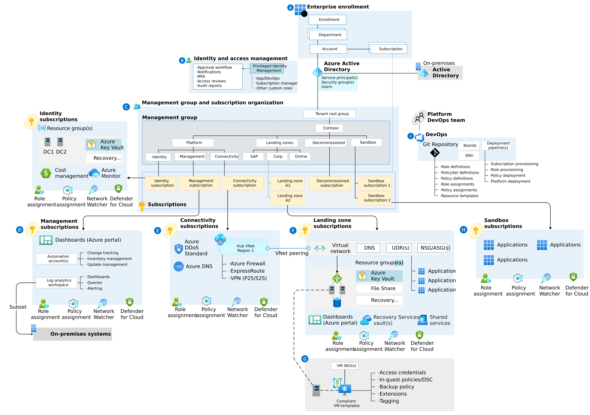

- [Azure Governance](#azure-governance)
	  - [Organization and governance recommendations](#organization-and-governance-recommendations)
		    - [Management Groups](#management-groups)
			      - [Platform Management Group](#platform-management-group)
		    - [Subscriptions](#subscriptions)
		    - [Quota and capacity recommendations](#quota-and-capacity-recommendations)
		    - [Tenant transfer restriction recommendations](#tenant-transfer-restriction-recommendations)
	  - [Azure Landing zone](#azure-landing-zone)
		    - [Platform landing zones](#platform-landing-zones)
		    - [Application landing zones](#application-landing-zones)
  
# Azure Governance
  
## Organization and governance recommendations

### Management Groups

- Group multiple subscriptions to Management Groups
- Group subscriptions based on geo location first then env / dept
- Apply common policies to the group of subscriptions
- Avoid a rigid subscription model. Instead, use a set of flexible criteria to group subscriptions across your organization.

#### Platform Management Group

**dedicated management subscription**
  - Global management capabilities like Azure Monitor Log Analytics workspaces and Azure Automation runbooks

**dedicated identity subscription**
  - host Windows Server Active Directory domain controllers

**dedicated connectivity subscription**
  - host an Azure Virtual WAN hub, private Domain Name System (DNS), ExpressRoute circuit, and other networking resources
  - all foundation network resources are billed together and isolated from other workloads

  

  

  

### Subscriptions

- Treat subscriptions as a unit of management aligned with business needs and priorities; a management boundary for governance and isolation, allowing a clear separation of concern
- Subscriptions serve as a boundary for the Azure Policy assignments
- Subscription owners should be aware of their roles and responsibilities
    - Do a quarterly or yearly access review for Azure AD Privileged Identity Management
    - Take full ownership of budget spending and resources
    - Ensure policy compliance and remediate when necessary
- Subscriptions serve as a scale unit for component workloads to scale within platform subscription limits

  

  

### Quota and capacity recommendations

- Use subscriptions as scale units, and scale out resources and subscriptions as required
- Use reserved instances to manage capacity in some regions
- Establish a dashboard with custom views to monitor used capacity levels, and set up alerts if capacity is approaching critical levels (90 percent CPU usage)
- Raise support requests for quota increases under subscription provisioning, such as for total available VM cores within a subscription.
- Ensure that quota limits are set before your workloads exceed the default limits
- Ensure that any required services and features are available within chosen deployment regions.

### Tenant transfer restriction recommendations

- Tenant transfer restriction
  -  Set Subscription leaving Azure AD directory to Permit no one.
  - Set Subscription entering Azure AD directory to Permit no one.
- Configure a limited list of exempted users.
  - Include members from an Azure Platform
  - Ops (platform operations) team.
  - Include break-glass accounts in the list of exempted users.

## Azure Landing zone

### Platform landing zones

- Subscriptions deployed to provide centralized services, often operated by a central team, or a number of central teams split by function (e.g. networking, identity), which will be used by various workloads and applications.

### Application landing zones

-  One or more subscriptions deployed as an environment for an application or workload
-  Application landing zones can be sub-categorized as
  - **Centrally managed**: A central IT team fully operates the landing zone. The team applies controls and platform tools to both the platform and application landing zones.
  - **Technology platforms**: With technology platforms such as AKS or AVS, the underlying service is often centrally managed. The applications running on top of the service have delegated responsibilities to application teams
  - **Workload**: A platform administration team delegates the entire landing zone to a workload team to fully manage and support the environment; whilst still being controlled by the policies applied from the Management Groups above that the platform team control

 
