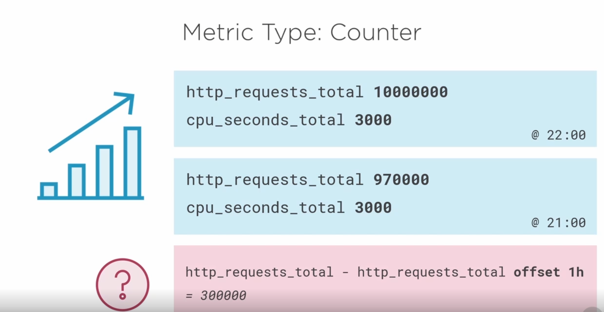
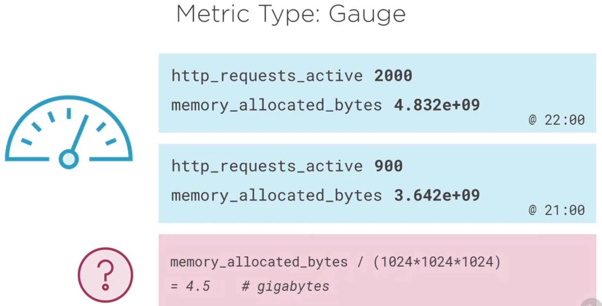
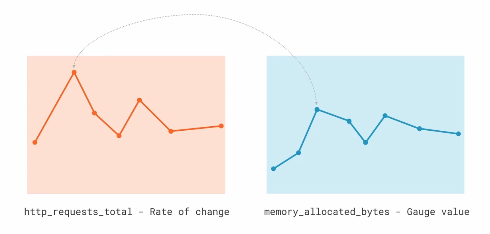
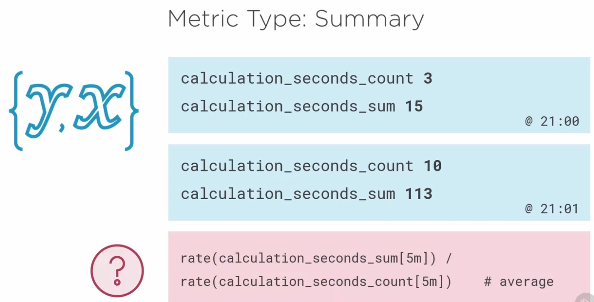
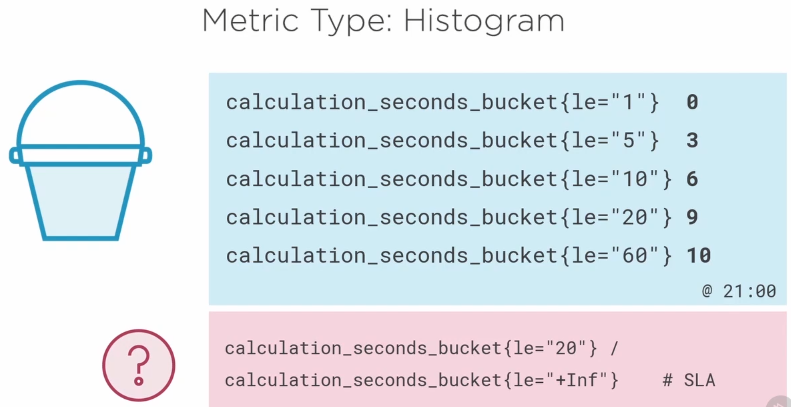

# Prometheus Basics

- [Prometheus Basics](#prometheus-basics)
  - [Metrics](#metrics)
    - [Metric Types](#metric-types)
  - [Performance Considerations](#performance-considerations)

## Metrics

Prometheus exporters export the monitoring values in specific formats:

- METRIC_NAME METRIC_VALUE
- METRIC_NAME{LABEL1="LVALUE1"} METRIC_VALUE
- METRIC_NAME{LABEL1="LVALUE1",LABEL2="VALUE2",..} METRIC_VALUE

### Metric Types

- Counter
- Gauge
- Summary
- Histogram

Counter

- value that always increases (total http requets)
- useful to measure rate of change



Guage

- Snapshot of changing value (memory usage)



Counter vs Gauge



Summary

- Record average of something
- 2 relative vaules are recorded together and the average is calulated using expressions later



Histogram

- Record values in buckets



> **NOTE**
>
> Its is best practice to use standard base units for the all the metrics (eg: bytes, second etc.,)
> Later they can be projected to more usage values using expressions (eg: GB, HR etc.,)

```bash
######## EXAMPLE SNIPPET FROM NODE EXPORTER ########

# HELP node_network_up Value is 1 if operstate is 'up', 0 otherwise.
# TYPE node_network_up gauge
node_network_up{device="docker0"} 0
node_network_up{device="ens3"} 1
node_network_up{device="lo"} 0

# HELP node_disk_writes_merged_total The number of writes merged.
# TYPE node_disk_writes_merged_total counter
node_disk_writes_merged_total{device="sda"} 8.4757843e+07
node_disk_writes_merged_total{device="sdb"} 21957
node_disk_writes_merged_total{device="sdc"} 6.965581e+06

# HELP node_disk_written_bytes_total The total number of bytes written successfully.
# TYPE node_disk_written_bytes_total counter
node_disk_written_bytes_total{device="sda"} 9.797835900928e+12
node_disk_written_bytes_total{device="sdb"} 1.41633536e+08
node_disk_written_bytes_total{device="sdc"} 3.50108055552e+11

# HELP node_uname_info Labeled system information as provided by the uname system call.
# TYPE node_uname_info gauge
node_uname_info{domainname="(none)",machine="x86_64",nodename="weblogictest-wls-0",release="5.4.17-2102.204.4.4.el7uek.x86_64",sysname="Linux",version="#2 SMP Tue Aug 17 20:25:28 PDT 2021"} 1


# HELP node_uname_info Labeled system information as provided by the uname system call.
# TYPE node_uname_info gauge
node_uname_info{domainname="(none)",machine="x86_64",nodename="weblogictest-wls-0",release="5.4.17-2102.204.4.4.el7uek.x86_64",sysname="Linux",version="#2 SMP Tue Aug 17 20:25:28 PDT 2021"} 1


```

## Performance Considerations

- Every metric is a "time series" in prometheus
- 1 metric on 10 servers is 10 time series data
- 1 metric with 4 labels on 10 servers is 40 time series data
- with every label, the data increases and so the cost of the resources
- Use less labels as possible
