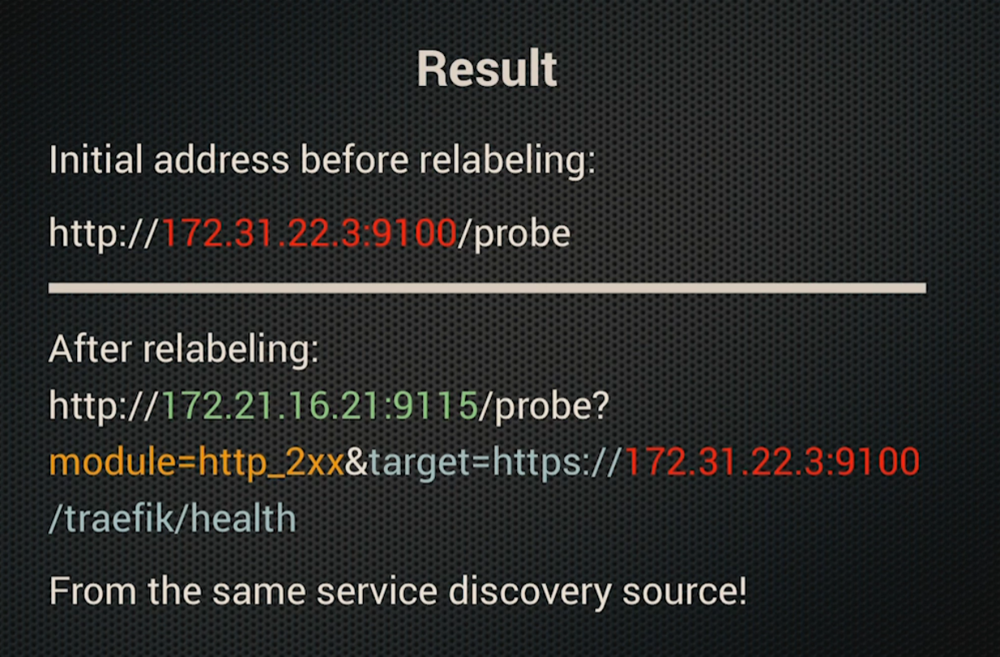
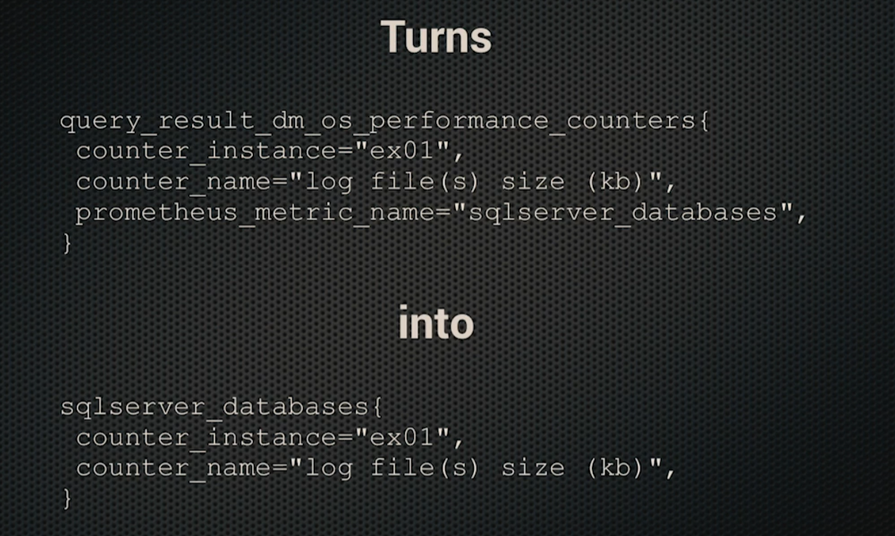
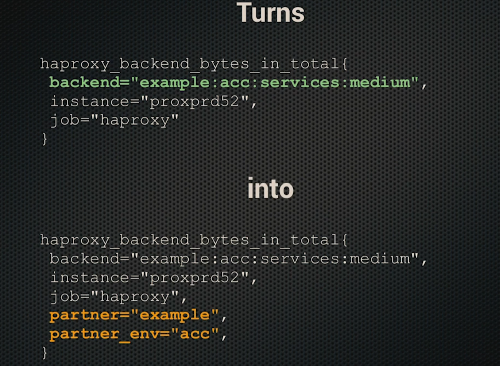

# Working with Labels

- [Working with Labels](#working-with-labels)
  - [Basics of labeling](#basics-of-labeling)
  - [When is a label used by Prometheus](#when-is-a-label-used-by-prometheus)
  - [Regex](#regex)
  - [Label Types](#label-types)
    - [Target Label](#target-label)
    - [Instance Label](#instance-label)
    - [Alert Label](#alert-label)
  - [Relabeling Types](#relabeling-types)
    - [relabel_configs](#relabel_configs)
    - [metric_relabel_configs](#metric_relabel_configs)
    - [alert_relabel_configs](#alert_relabel_configs)
  - [Label actions](#label-actions)
  - [Multiple labels and actions](#multiple-labels-and-actions)
  - [Examples](#examples)
    - [relabel configs](#relabel-configs)
    - [Relabeling at metric level](#relabeling-at-metric-level)
    - [Choosing Target to scrape](#choosing-target-to-scrape)
    - [Drop Target](#drop-target)
    - [Modify Target labels](#modify-target-labels)
    - [Reusing targets](#reusing-targets)
    - [Relabeling metrics during scrape](#relabeling-metrics-during-scrape)
    - [Extracting labels](#extracting-labels)
    - [Droping metrics](#droping-metrics)
    - [Relabeling Alerts](#relabeling-alerts)

## Basics of labeling

- Instrumentation labels come from application
- Service Discovery creates targets
- Relabeling filter targets and adds target labels to amke them meaningful
- Metric relabel configs apply to scraped time series
- Alerts can add labels before sebding to alertmanager
- Alertmanager uses labels for routing, grouping, deduplicating and silencing

## When is a label used by Prometheus

Labels are used:

- Before scraping targets; prometheus uses some labels as configurations
- When scraping targets, prometheus will fetch labels of metrics and add its own
- After scraping, before registring metrics, labels can be altered
- With recording rules
- Also on the federation endpoint Prometheus can add labels (Azure, GCP, etc.,)
- When sending alerts we can alter the labels

## Regex

- Prometheus uses RE2 regular expression
- REGIX is anchored, which means `bar` regex will not match `foobar`
- It can be unanchored with `.*bar.*`
- Can capture groups: `(.*)bar` used against `foobar` will create a variable $1 whose value is `foo`

Examples:

- `prom|alert` will match `prom` and `alert`
- `202[23]` will match `2022` and `2023`
- `.` matches any character
- `.*` matches 0 or more characters
- `.+` matches one or more characters
- `.?` matches zero or one character
- `()` capture group

## Label Types

### Target Label

### Instance Label

- The lablel that SD returs with `host:port` is `__address__`
- if no `instance` label is present by end of relabeling, it defaults to `__address__`

### Alert Label

- the alert will have `method` and `endpoint` labels from the alert expression and a `serverity` label

## Relabeling Types

There are multiple relabeling types:

- relabel_configs
- metric_relabel_configs
- alert_relabel_configs

### relabel_configs

- applied before the scrape
- could be used to select which target to scrape

### metric_relabel_configs

- applied after the scrape to all scraped samples just before they're added to the database
- could be used to drop expensive metrics or fix a label value
- `up` isnt a scraped metric, only `relabel_configs` apply

### alert_relabel_configs

## Label actions

Basic Actions:

- `keep` - halts if the regex does not match the target pattern
- `drop` - halts if the regex matches the target pattern

Advance actions:

- `labelmap` copies labels based on regex substitition. meaning that `regex` and `replace` apply to the label names and not the label values
- `hashmod` is used along with `keep` for sharding

## Multiple labels and actions

- `source_labels` is a list so many labels can be specified seperated by `;` and the seperatoe can be changed via `seperator`
- `relabel_configs` is a list and many actions can be added
- All actions are applied until a `keep` or `drop` halts it
- Empty label is same as not having lable

## Examples

### relabel configs

- Prometheus needs to know what to scrape, and that's where service discovery and *relabel_configs* come in. Relabel configs allow you to select which targets you want scraped, and what the target labels will be. So if you want to say scrape this type of machine but not that one, use *relabel_configs*
- temporary labels that come from service discovery so can be used to filter out the targets

```yml
scrape_configs:
  - job_name: 'prometheus'
    static_configs:
      - targets: ['localhost:9100']
    # replace the label name
    relabel_configs:
      - source_labels: [__address__]
        target_label: server  # replaces "__name__" with "server"
    # replace the label value
    relabel_configs:
      - source_labels: [__name__]
        target_label: __name__
```

### Relabeling at metric level

- *metric_relabel_configs* by contrast are applied after the scrape has happened, but before the data is ingested by the storage system. So if there are some expensive metrics you want to drop, or labels coming from the scrape itself (e.g. from the /metrics page) that you want to manipulate that's where  *metric_relabel_configs* applies.
- to tidy up the labels before they saved to prometheus

```yml
scrape_configs:
  - job_name: 'prometheus'
    static_configs:
      - targets: ['localhost:9100']
    metric_relabel_configs:
    # drop a metric matching a pattern
    - source_labels: [__name__]
        regex: 'go_.*'
        action: drop
    # drop a metric with specific lable value
      - source_labels: [__name__, app]
        regex: '.*;bea_.*' # first maps to the metic and second maps to value of label "app" seperated by ";"
        action: drop

```

### Choosing Target to scrape

The simplest label handling is to use Service Discovery to look for targets and use regex to pick the targets to scrape
  
```yml
  - job_name: 'dynamic-servers'
    file_sd_configs:
      - files:
        - 'serverlist.json'
    relabel_configs:
      - source_labels: ["__meta_consul_tags"]
        regex: ".*,production,.*"
        action: keep
```

### Drop Target

```yml
# on the first server - drop all ip address with even no
    relabel_configs:
      - source_labels: ['__address__']
        regex: '.+[02468]:.+'
        action: drop
# on the second server - keep all ip addresses with even no
    relabel_configs:
      - source_labels: ['__address__']
        regex: '.+[02468]:.+'
        action: keep
```

### Modify Target labels

- Core of relabelling is the `replace` action
- It applies a `regex` to the `source_labels`, if it matches, substitute the regex group with  `replacement` and writes the result to `target_label`
- Empty label means label is removed
- `__meta` labels are discarded after relabeling

```yaml
relabel_configs:
  - source_labels: ["__meta_ec2_tag_Name"]
    regex: "(.*)"
    action: replace
    replacement: "${1}"
    target_label: "job"
```

Because `replace` is the default action, the above block can also be written as below:

```yaml
relabel_configs:
  - source_labels: ["__meta_ec2_tag_Name"]
    target_label: "job"
```

### Reusing targets

- Using the blackbox exporter against a ssl enabled target to check its certs

```yml
# initial job:
- job_name: treafik
  file_sd_configs:
  - files:
    - /etc/prometheus/traefik_*.yml
  metrics_path: '/traefik/metrics'
  scheme: https
# reusing the same file for another job
- job: traefik_blackbox
  file_sd_configs:
  - files:
    - /etc/prometheus/traefik_*.yml
  metrics_path: '/probe'
  relabel_configs:
  - source_labels: [__address__]
    replacement: 'https://$1/treafix/health'
    target_label: __param_target
  - replacement: http_2xx
    target_label: __param_module
  - replacement: '172.31.22.3:9155'
    target_label: __address__
```



### Relabeling metrics during scrape

```yml
scrape_configs:
  - job_name: 'sql'
    static_configs:
      - targets: ['sqlserver:41212']
    metric_relabel_configs:
      - source_labels: ['prometheus_metric_name']
        target_label: [__name__]
        regex: '(.*[^_])_*'
        replacement: '${1}'
      - regex: prometheus_metric_name
        action: labeldrop
```



### Extracting labels

```yml
      - source_labels: ['__name__','backend']
        target_label: 'partner'
        regex: 'haproxy_.+;(.+):(.+):(.+):(.+)'
        replacement: '${1}'
      - source_labels: ['__name__','backend']
        target_label: 'partner_env'
        regex: 'haproxy_.+;(.+):(.+):(.+):(.+)'
        replacement: '${2}'
```



### Droping metrics

```yml
      - source_labels: ['__name__']
        regex: 'jira_user_login_count'
        action: drop
      - source_labels: ['__name__']
        regex: 'jira_dashboard_view_count'
        action: drop
      - source_labels: ['__name__']
        regex: 'jira_issue_update_count'
        action: drop
```

### Relabeling Alerts

```yml
alerting:
  alert_relabel_configs:
    - source_labels: [prometheus_server]
      target_label: prometheus_server
      replacement: promdcl
    - source_labels: [priority]
      target_label: prometheus_sepriorityrver
      reges: '()'
      replacement: P1
```
